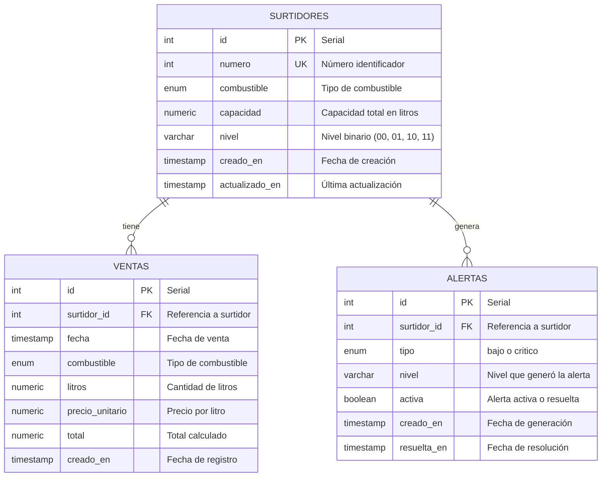

# 🗄️ Base de Datos — Diseño y Esquema

> Documentación completa de la base de datos del **Sistema de Control para Surtidor de Gasolina**.

---

## 📋 Índice

1. [Diagrama Entidad-Relación](#diagrama-entidad-relación)
2. [Tipos Personalizados](#tipos-personalizados)
3. [Tablas](#tablas)
   - [Surtidores](#surtidores)
   - [Ventas](#ventas)
   - [Alertas](#alertas)
4. [Triggers y Funciones](#triggers-y-funciones)
5. [Políticas de Seguridad (RLS)](#políticas-de-seguridad-rls)
6. [Índices](#índices)
7. [Relación con Sistemas Digitales](#relación-con-sistemas-digitales)
8. [Script SQL Completo](#script-sql-completo)

---

## <a name="diagrama-entidad-relación"></a>Diagrama Entidad-Relación



---

## <a name="tipos-personalizados"></a>Tipos Personalizados

### `tipo_combustible`

Enumera los tipos de combustible disponibles en la estación.

```sql
CREATE TYPE tipo_combustible AS ENUM (
    'gasolina_regular',   -- Gasolina Regular (85 octanos)
    'gasolina_premium',   -- Gasolina Premium (95 octanos)
    'diesel'              -- Diésel
);
```

**Relación con Sistemas Digitales:** Los tipos de combustible se codifican mediante un **decodificador**:

| Código | Combustible |
|--------|-------------|
| `00` | Gasolina Regular |
| `01` | Gasolina Premium |
| `10` | Diésel |

### `tipo_alerta`

Define los niveles de alerta del sistema.

```sql
CREATE TYPE tipo_alerta AS ENUM (
    'bajo',    -- Nivel bajo (LED amarillo) — nivel ≤ 25%
    'critico'  -- Nivel crítico (LED rojo) — nivel ≤ 10%
);
```

---

## <a name="tablas"></a>Tablas

### <a name="surtidores"></a>⛽ Surtidores

Registro de cada surtidor de la estación con su nivel actual.

```sql
CREATE TABLE surtidores (
    id              SERIAL PRIMARY KEY,
    numero          INTEGER NOT NULL UNIQUE,
    combustible     tipo_combustible NOT NULL,
    capacidad       NUMERIC(10, 2) NOT NULL CHECK (capacidad > 0),
    nivel           VARCHAR(2) NOT NULL DEFAULT '11'
                    CHECK (nivel IN ('00', '01', '10', '11')),
    creado_en       TIMESTAMPTZ NOT NULL DEFAULT NOW(),
    actualizado_en  TIMESTAMPTZ NOT NULL DEFAULT NOW()
);

COMMENT ON TABLE surtidores IS 'Registro de surtidores de gasolina con nivel de combustible representado en binario';
COMMENT ON COLUMN surtidores.nivel IS 'Nivel de combustible en binario: 00=vacío, 01=25%, 10=50%, 11=100%';
```

#### Campos

| Campo | Tipo | Descripción |
|-------|------|-------------|
| `id` | `SERIAL PRIMARY KEY` | Identificador único del surtidor |
| `numero` | `INTEGER NOT NULL UNIQUE` | Número identificador del surtidor (visible en la estación) |
| `combustible` | `tipo_combustible NOT NULL` | Tipo de combustible que despacha |
| `capacidad` | `NUMERIC(10,2) NOT NULL` | Capacidad total del tanque en litros |
| `nivel` | `VARCHAR(2) NOT NULL DEFAULT '11'` | Nivel actual en representación binaria de 2 bits |
| `creado_en` | `TIMESTAMPTZ NOT NULL DEFAULT NOW()` | Fecha y hora de registro |
| `actualizado_en` | `TIMESTAMPTZ NOT NULL DEFAULT NOW()` | Fecha y hora de última actualización |

### <a name="ventas"></a>💰 Ventas

Registro de transacciones de venta de combustible.

```sql
CREATE TABLE ventas (
    id                SERIAL PRIMARY KEY,
    surtidor_id       INTEGER NOT NULL REFERENCES surtidores(id) ON DELETE RESTRICT,
    fecha             TIMESTAMPTZ NOT NULL DEFAULT NOW(),
    combustible       tipo_combustible NOT NULL,
    litros            NUMERIC(10, 2) NOT NULL CHECK (litros > 0),
    precio_unitario   NUMERIC(10, 2) NOT NULL CHECK (precio_unitario > 0),
    total             NUMERIC(10, 2) NOT NULL CHECK (total > 0),
    creado_en         TIMESTAMPTZ NOT NULL DEFAULT NOW()
);

COMMENT ON TABLE ventas IS 'Historial de ventas de combustible con cálculos usando aritmética binaria';
COMMENT ON COLUMN ventas.total IS 'Total calculado: litros × precio_unitario (demostrable con aritmética binaria)';
```

#### Campos

| Campo | Tipo | Descripción |
|-------|------|-------------|
| `id` | `SERIAL PRIMARY KEY` | Identificador único de la venta |
| `surtidor_id` | `INTEGER NOT NULL FK` | Referencia al surtidor que realizó la venta |
| `fecha` | `TIMESTAMPTZ NOT NULL` | Fecha y hora de la venta |
| `combustible` | `tipo_combustible NOT NULL` | Tipo de combustible vendido |
| `litros` | `NUMERIC(10,2) NOT NULL` | Cantidad de litros despachados |
| `precio_unitario` | `NUMERIC(10,2) NOT NULL` | Precio por litro en bolivianos |
| `total` | `NUMERIC(10,2) NOT NULL` | Total de la venta (litros × precio_unitario) |
| `creado_en` | `TIMESTAMPTZ NOT NULL` | Fecha de registro |

### <a name="alertas"></a>🚨 Alertas

Registro de alertas generadas por niveles bajos o críticos de combustible.

```sql
CREATE TABLE alertas (
    id              SERIAL PRIMARY KEY,
    surtidor_id     INTEGER NOT NULL REFERENCES surtidores(id) ON DELETE CASCADE,
    tipo            tipo_alerta NOT NULL,
    nivel           VARCHAR(2) NOT NULL CHECK (nivel IN ('00', '01', '10', '11')),
    activa          BOOLEAN NOT NULL DEFAULT TRUE,
    creado_en       TIMESTAMPTZ NOT NULL DEFAULT NOW(),
    resuelta_en     TIMESTAMPTZ
);
```

#### Campos

| Campo | Tipo | Descripción |
|-------|------|-------------|
| `id` | `SERIAL PRIMARY KEY` | Identificador único de la alerta |
| `surtidor_id` | `INTEGER NOT NULL FK` | Surtidor que genera la alerta |
| `tipo` | `tipo_alerta NOT NULL` | Tipo de alerta: `bajo` (LED amarillo) o `critico` (LED rojo) |
| `nivel` | `VARCHAR(2) NOT NULL` | Nivel binario que generó la alerta |
| `activa` | `BOOLEAN NOT NULL DEFAULT TRUE` | Estado de la alerta |
| `creado_en` | `TIMESTAMPTZ NOT NULL` | Fecha de generación |
| `resuelta_en` | `TIMESTAMPTZ` | Fecha de resolución (cuando se reabastece) |

---

## <a name="triggers-y-funciones"></a>Triggers y Funciones

### `actualizar_actualizado_en()`

Actualiza automáticamente el campo `actualizado_en` al modificar un surtidor.

```sql
CREATE OR REPLACE FUNCTION actualizar_actualizado_en()
RETURNS TRIGGER AS $$
BEGIN
    NEW.actualizado_en = NOW();
    RETURN NEW;
END;
$$ LANGUAGE plpgsql;

CREATE TRIGGER trigger_actualizar_surtidor
    BEFORE UPDATE ON surtidores
    FOR EACH ROW
    EXECUTE FUNCTION actualizar_actualizado_en();
```

### `generar_alerta_nivel()`

Genera alertas automáticas cuando el nivel de un surtidor cambia a un estado crítico o bajo.

> **Relación con Sistemas Digitales:** Esta función implementa la lógica de **compuertas lógicas** y **mapas de Karnaugh** para determinar el tipo de alerta.

```sql
CREATE OR REPLACE FUNCTION generar_alerta_nivel()
RETURNS TRIGGER AS $$
DECLARE
    v_nivel_bajo BOOLEAN;
    v_nivel_critico BOOLEAN;
BEGIN
    -- Lógica de compuertas lógicas para determinar alertas
    -- Basada en mapa de Karnaugh:
    --
    --        N1\N0 | 0 | 1
    --        ------+---+---
    --          0   | R | A
    --          1   | - | -
    --
    -- Donde:
    --   N1 = MSB, N0 = LSB
    --   R = Alerta Roja (Crítica) = ¬N1 · ¬N0  → nivel '00'
    --   A = Alerta Amarilla (Baja) = ¬N1 · N0   → nivel '01'
    --   - = Sin alerta                           → nivel '10', '11'

    v_nivel_critico := (NEW.nivel = '00');  -- ¬N1 · ¬N0
    v_nivel_bajo    := (NEW.nivel = '01');  -- ¬N1 · N0

    -- Resolver alertas previas del mismo surtidor si el nivel mejoró
    IF NEW.nivel IN ('10', '11') THEN
        UPDATE alertas
        SET activa = FALSE,
            resuelta_en = NOW()
        WHERE surtidor_id = NEW.id AND activa = TRUE;
    END IF;

    -- Generar nueva alerta si es necesario
    IF v_nivel_critico THEN
        INSERT INTO alertas (surtidor_id, tipo, nivel)
        VALUES (NEW.id, 'critico', NEW.nivel);
    ELSIF v_nivel_bajo THEN
        INSERT INTO alertas (surtidor_id, tipo, nivel)
        VALUES (NEW.id, 'bajo', NEW.nivel);
    END IF;

    RETURN NEW;
END;
$$ LANGUAGE plpgsql;

CREATE TRIGGER trigger_control_nivel
    AFTER UPDATE OF nivel ON surtidores
    FOR EACH ROW
    WHEN (OLD.nivel IS DISTINCT FROM NEW.nivel)
    EXECUTE FUNCTION generar_alerta_nivel();
```

### `actualizar_nivel_por_venta()`

Actualiza el nivel del surtidor automáticamente después de cada venta, restando los litros vendidos.

```sql
CREATE OR REPLACE FUNCTION actualizar_nivel_por_venta()
RETURNS TRIGGER AS $$
DECLARE
    v_capacidad NUMERIC;
    v_nivel_actual NUMERIC;
    v_nuevo_nivel NUMERIC;
    v_porcentaje NUMERIC;
BEGIN
    -- Obtener capacidad y nivel actual del surtidor
    SELECT capacidad,
           CASE s.nivel
               WHEN '11' THEN 100.0
               WHEN '10' THEN 50.0
               WHEN '01' THEN 25.0
               ELSE 0.0
           END
    INTO v_capacidad, v_nivel_actual
    FROM surtidores s
    WHERE s.id = NEW.surtidor_id;

    -- Calcular nuevo nivel como porcentaje
    v_nuevo_nivel := v_nivel_actual - ((NEW.litros / v_capacidad) * 100);
    v_porcentaje := GREATEST(0, v_nuevo_nivel);

    -- Actualizar nivel en representación binaria
    UPDATE surtidores
    SET nivel = CASE
        WHEN v_porcentaje <= 0   THEN '00'  -- Vacío
        WHEN v_porcentaje <= 25  THEN '01'  -- 25%
        WHEN v_porcentaje <= 50  THEN '10'  -- 50%
        ELSE '11'                          -- 100% (o ≥ 50%)
    END
    WHERE id = NEW.surtidor_id;

    RETURN NEW;
END;
$$ LANGUAGE plpgsql;

CREATE TRIGGER trigger_venta_actualiza_nivel
    AFTER INSERT ON ventas
    FOR EACH ROW
    EXECUTE FUNCTION actualizar_nivel_por_venta();
```

---

## <a name="políticas-de-seguridad-rls"></a>Políticas de Seguridad (RLS)

Supabase utiliza **Row Level Security (RLS)** para controlar el acceso a los datos a nivel de fila.

```sql
-- Habilitar RLS en todas las tablas
ALTER TABLE surtidores ENABLE ROW LEVEL SECURITY;
ALTER TABLE ventas ENABLE ROW LEVEL SECURITY;
ALTER TABLE alertas ENABLE ROW LEVEL SECURITY;

-- Políticas para usuarios autenticados

-- SURTIDORES: CRUD completo para usuarios autenticados
CREATE POLICY "Usuarios autenticados pueden leer surtidores"
    ON surtidores FOR SELECT
    TO authenticated
    USING (TRUE);

CREATE POLICY "Usuarios autenticados pueden crear surtidores"
    ON surtidores FOR INSERT
    TO authenticated
    WITH CHECK (TRUE);

CREATE POLICY "Usuarios autenticados pueden editar surtidores"
    ON surtidores FOR UPDATE
    TO authenticated
    USING (TRUE)
    WITH CHECK (TRUE);

CREATE POLICY "Usuarios autenticados pueden eliminar surtidores"
    ON surtidores FOR DELETE
    TO authenticated
    USING (TRUE);

-- VENTAS: Solo lectura para todos, escritura para autenticados
CREATE POLICY "Lectura de ventas para autenticados"
    ON ventas FOR SELECT
    TO authenticated
    USING (TRUE);

CREATE POLICY "Inserción de ventas para autenticados"
    ON ventas FOR INSERT
    TO authenticated
    WITH CHECK (TRUE);

-- ALERTAS: Lectura para autenticados, solo el sistema inserta
CREATE POLICY "Lectura de alertas para autenticados"
    ON alertas FOR SELECT
    TO authenticated
    USING (TRUE);

CREATE POLICY "El sistema puede insertar alertas"
    ON alertas FOR INSERT
    TO authenticated
    WITH CHECK (TRUE);

CREATE POLICY "Usuarios pueden resolver alertas"
    ON alertas FOR UPDATE
    TO authenticated
    USING (TRUE)
    WITH CHECK (TRUE);
```

---

## <a name="índices"></a>Índices

Índices recomendados para optimizar consultas frecuentes:

```sql
-- Búsqueda rápida de surtidores por número (único, ya tiene índice)
CREATE INDEX idx_surtidores_combustible ON surtidores(combustible);
CREATE INDEX idx_surtidores_nivel ON surtidores(nivel);

-- Consultas de ventas por fecha (reportes diarios)
CREATE INDEX idx_ventas_fecha ON ventas(fecha);
CREATE INDEX idx_ventas_surtidor ON ventas(surtidor_id);
CREATE INDEX idx_ventas_combustible ON ventas(combustible);

-- Alertas activas
CREATE INDEX idx_alertas_activas ON alertas(activa) WHERE activa = TRUE;
CREATE INDEX idx_alertas_surtidor ON alertas(surtidor_id);
```

---

## <a name="relación-con-sistemas-digitales"></a>Relación con Sistemas Digitales

### Representación Binaria de Niveles

| Bits (N1 N0) | Nivel | Porcentaje | Interpretación |
|:------------:|:-----:|:----------:|:--------------:|
| `00` | Vacío | 0% | Surtidor vacío, alerta **roja** |
| `01` | Bajo | 25% | Nivel bajo, alerta **amarilla** |
| `10` | Medio | 50% | Operación normal |
| `11` | Lleno | 100% | Capacidad máxima |

### Compuertas Lógicas para Alertas

La lógica de alertas se deriva de un **mapa de Karnaugh**:

```
Expresión booleana minimizada:

Alerta_Amarilla (bajo) = ¬N1 · N0    → nivel '01'
Alerta_Roja (crítico) = ¬N1 · ¬N0    → nivel '00'

Circuito lógico:

  N1 ──┬── INV ──┐
       │         ├── AND ── Alerta_Amarilla
  N0 ──┴─────────┘

  N1 ──┬── INV ──┐
       │         ├── AND ── Alerta_Roja
  N0 ──┴── INV ──┘
```

### Decodificador de Combustible

```sql
CREATE OR REPLACE FUNCTION decodificar_combustible(codigo VARCHAR(2))
RETURNS tipo_combustible AS $$
BEGIN
    RETURN CASE codigo
        WHEN '00' THEN 'gasolina_regular'::tipo_combustible
        WHEN '01' THEN 'gasolina_premium'::tipo_combustible
        WHEN '10' THEN 'diesel'::tipo_combustible
        ELSE NULL
    END;
END;
$$ LANGUAGE plpgsql IMMUTABLE;
```

---

## <a name="script-sql-completo"></a>Script SQL Completo

<details>
<summary>📜 Ver script SQL completo para ejecutar en Supabase SQL Editor</summary>

```sql
-- ============================================
-- SISTEMA DE CONTROL PARA SURTIDOR DE GASOLINA
-- "El Surtidor Cochabambino"
-- Script completo de base de datos
-- ============================================

-- 1. TIPOS PERSONALIZADOS
-- ============================================

CREATE TYPE tipo_combustible AS ENUM (
    'gasolina_regular',
    'gasolina_premium',
    'diesel'
);

CREATE TYPE tipo_alerta AS ENUM (
    'bajo',
    'critico'
);

-- 2. TABLAS
-- ============================================

CREATE TABLE surtidores (
    id              SERIAL PRIMARY KEY,
    numero          INTEGER NOT NULL UNIQUE,
    combustible     tipo_combustible NOT NULL,
    capacidad       NUMERIC(10, 2) NOT NULL CHECK (capacidad > 0),
    nivel           VARCHAR(2) NOT NULL DEFAULT '11'
                    CHECK (nivel IN ('00', '01', '10', '11')),
    creado_en       TIMESTAMPTZ NOT NULL DEFAULT NOW(),
    actualizado_en  TIMESTAMPTZ NOT NULL DEFAULT NOW()
);

CREATE TABLE ventas (
    id                SERIAL PRIMARY KEY,
    surtidor_id       INTEGER NOT NULL REFERENCES surtidores(id) ON DELETE RESTRICT,
    fecha             TIMESTAMPTZ NOT NULL DEFAULT NOW(),
    combustible       tipo_combustible NOT NULL,
    litros            NUMERIC(10, 2) NOT NULL CHECK (litros > 0),
    precio_unitario   NUMERIC(10, 2) NOT NULL CHECK (precio_unitario > 0),
    total             NUMERIC(10, 2) NOT NULL CHECK (total > 0),
    creado_en         TIMESTAMPTZ NOT NULL DEFAULT NOW()
);

CREATE TABLE alertas (
    id              SERIAL PRIMARY KEY,
    surtidor_id     INTEGER NOT NULL REFERENCES surtidores(id) ON DELETE CASCADE,
    tipo            tipo_alerta NOT NULL,
    nivel           VARCHAR(2) NOT NULL CHECK (nivel IN ('00', '01', '10', '11')),
    activa          BOOLEAN NOT NULL DEFAULT TRUE,
    creado_en       TIMESTAMPTZ NOT NULL DEFAULT NOW(),
    resuelta_en     TIMESTAMPTZ
);

-- 3. FUNCIONES Y TRIGGERS
-- ============================================

CREATE OR REPLACE FUNCTION actualizar_actualizado_en()
RETURNS TRIGGER AS $$
BEGIN
    NEW.actualizado_en = NOW();
    RETURN NEW;
END;
$$ LANGUAGE plpgsql;

CREATE TRIGGER trigger_actualizar_surtidor
    BEFORE UPDATE ON surtidores
    FOR EACH ROW
    EXECUTE FUNCTION actualizar_actualizado_en();

CREATE OR REPLACE FUNCTION generar_alerta_nivel()
RETURNS TRIGGER AS $$
DECLARE
    v_nivel_bajo BOOLEAN;
    v_nivel_critico BOOLEAN;
BEGIN
    v_nivel_critico := (NEW.nivel = '00');
    v_nivel_bajo    := (NEW.nivel = '01');

    IF NEW.nivel IN ('10', '11') THEN
        UPDATE alertas
        SET activa = FALSE,
            resuelta_en = NOW()
        WHERE surtidor_id = NEW.id AND activa = TRUE;
    END IF;

    IF v_nivel_critico THEN
        INSERT INTO alertas (surtidor_id, tipo, nivel)
        VALUES (NEW.id, 'critico', NEW.nivel);
    ELSIF v_nivel_bajo THEN
        INSERT INTO alertas (surtidor_id, tipo, nivel)
        VALUES (NEW.id, 'bajo', NEW.nivel);
    END IF;

    RETURN NEW;
END;
$$ LANGUAGE plpgsql;

CREATE TRIGGER trigger_control_nivel
    AFTER UPDATE OF nivel ON surtidores
    FOR EACH ROW
    WHEN (OLD.nivel IS DISTINCT FROM NEW.nivel)
    EXECUTE FUNCTION generar_alerta_nivel();

CREATE OR REPLACE FUNCTION actualizar_nivel_por_venta()
RETURNS TRIGGER AS $$
DECLARE
    v_capacidad NUMERIC;
    v_nivel_actual NUMERIC;
    v_nuevo_nivel NUMERIC;
    v_porcentaje NUMERIC;
BEGIN
    SELECT capacidad,
           CASE s.nivel
               WHEN '11' THEN 100.0
               WHEN '10' THEN 50.0
               WHEN '01' THEN 25.0
               ELSE 0.0
           END
    INTO v_capacidad, v_nivel_actual
    FROM surtidores s
    WHERE s.id = NEW.surtidor_id;

    v_nuevo_nivel := v_nivel_actual - ((NEW.litros / v_capacidad) * 100);
    v_porcentaje := GREATEST(0, v_nuevo_nivel);

    UPDATE surtidores
    SET nivel = CASE
        WHEN v_porcentaje <= 0   THEN '00'
        WHEN v_porcentaje <= 25  THEN '01'
        WHEN v_porcentaje <= 50  THEN '10'
        ELSE '11'
    END
    WHERE id = NEW.surtidor_id;

    RETURN NEW;
END;
$$ LANGUAGE plpgsql;

CREATE TRIGGER trigger_venta_actualiza_nivel
    AFTER INSERT ON ventas
    FOR EACH ROW
    EXECUTE FUNCTION actualizar_nivel_por_venta();

-- 4. ÍNDICES
-- ============================================

CREATE INDEX idx_surtidores_combustible ON surtidores(combustible);
CREATE INDEX idx_surtidores_nivel ON surtidores(nivel);
CREATE INDEX idx_ventas_fecha ON ventas(fecha);
CREATE INDEX idx_ventas_surtidor ON ventas(surtidor_id);
CREATE INDEX idx_ventas_combustible ON ventas(combustible);
CREATE INDEX idx_alertas_activas ON alertas(activa) WHERE activa = TRUE;
CREATE INDEX idx_alertas_surtidor ON alertas(surtidor_id);

-- 5. RLS (Row Level Security)
-- ============================================

ALTER TABLE surtidores ENABLE ROW LEVEL SECURITY;
ALTER TABLE ventas ENABLE ROW LEVEL SECURITY;
ALTER TABLE alertas ENABLE ROW LEVEL SECURITY;

-- SURTIDORES
CREATE POLICY "Usuarios autenticados pueden leer surtidores"
    ON surtidores FOR SELECT TO authenticated USING (TRUE);
CREATE POLICY "Usuarios autenticados pueden crear surtidores"
    ON surtidores FOR INSERT TO authenticated WITH CHECK (TRUE);
CREATE POLICY "Usuarios autenticados pueden editar surtidores"
    ON surtidores FOR UPDATE TO authenticated USING (TRUE) WITH CHECK (TRUE);
CREATE POLICY "Usuarios autenticados pueden eliminar surtidores"
    ON surtidores FOR DELETE TO authenticated USING (TRUE);

-- VENTAS
CREATE POLICY "Lectura de ventas para autenticados"
    ON ventas FOR SELECT TO authenticated USING (TRUE);
CREATE POLICY "Inserción de ventas para autenticados"
    ON ventas FOR INSERT TO authenticated WITH CHECK (TRUE);

-- ALERTAS
CREATE POLICY "Lectura de alertas para autenticados"
    ON alertas FOR SELECT TO authenticated USING (TRUE);
CREATE POLICY "El sistema puede insertar alertas"
    ON alertas FOR INSERT TO authenticated WITH CHECK (TRUE);
CREATE POLICY "Usuarios pueden resolver alertas"
    ON alertas FOR UPDATE TO authenticated USING (TRUE) WITH CHECK (TRUE);

-- ============================================
-- FIN DEL SCRIPT
-- ============================================
```

</details>

---

<div align="center">
  <a href="technologies.md">← Tecnologías</a> •
  <a href="../README.md">Volver al README</a> •
  <a href="architecture.md">Arquitectura →</a>
</div>
