```mermaid
erDiagram
    profiles ||--o{ user_roles : tiene
    roles ||--o{ user_roles : asigna
    profiles ||--o{ turnos : "registra"
    profiles ||--o{ ventas : "registra"

    surtidores ||--o{ ventas : "genera"
    surtidores ||--o{ alertas : "produce"
    surtidores ||--o{ abastecimientos : "recibe"

    tipos_combustible ||--o{ surtidores : "contiene"
    tipos_combustible ||--o{ precios_combustible : "tiene"
    tipos_combustible ||--o{ ventas : "referencia"
    tipos_combustible ||--o{ abastecimientos : "referencia"

    proveedores ||--o{ abastecimientos : "suministra"

    ventas ||--o{ pagos : "recibe"
    metodos_pago ||--o{ pagos : "utiliza"

    profiles {
        uuid id PK "Referencia a auth.users"
        text email "Email del usuario"
        text nombre_completo "Nombre completo"
        text telefono "Teléfono de contacto"
        boolean activo "Usuario activo/inactivo"
        timestamp creado_en "Fecha de registro"
        timestamp actualizado_en "Última actualización"
    }

    roles {
        text nombre PK "admin, supervisor, operador, auditor"
        text descripcion "Descripción del rol"
        jsonb permisos "Lista de permisos asociados"
    }

    user_roles {
        uuid usuario_id PK,FK "Referencia a profiles"
        text rol PK,FK "Referencia a roles"
        timestamp asignado_en "Fecha de asignación"
    }

    tipos_combustible {
        text id PK "gasolina_regular, gasolina_premium, diesel"
        text nombre "Nombre para mostrar"
        text descripcion "Descripción del combustible"
        text unidad "litro, galon"
        boolean activo "Disponible para venta"
    }

    surtidores {
        int id PK "Serial"
        int numero UK "Número de surtidor"
        text tipo_combustible_id FK "Tipo de combustible"
        numeric capacidad "Capacidad total en litros"
        varchar nivel "vacio, bajo, medio, lleno"
        numeric nivel_litros "Nivel actual en litros"
        boolean activo "Surtidor operativo"
        uuid creado_por FK "Usuario que registró"
        timestamp creado_en "Fecha de registro"
        timestamp actualizado_en "Última actualización"
    }

    precios_combustible {
        int id PK "Serial"
        text tipo_combustible_id FK "Tipo de combustible"
        numeric precio_por_litro "Precio en Bs"
        date fecha_inicio "Vigencia desde"
        date fecha_fin "Vigencia hasta (nullable)"
        uuid actualizado_por FK "Usuario que actualizó"
        timestamp creado_en "Fecha de registro"
    }

    ventas {
        uuid id PK "UUID v4"
        int surtidor_id FK "Surtidor que despachó"
        text tipo_combustible_id FK "Combustible vendido"
        numeric litros "Litros despachados"
        numeric precio_unitario "Precio por litro aplicado"
        numeric subtotal "Subtotal antes de impuestos"
        numeric impuesto "Impuesto aplicado (ej: 13% IVA)"
        numeric total "Total final"
        uuid registrado_por FK "Operador que registró"
        uuid turno_id FK "Turno en que se registró"
        text notas "Notas u observaciones"
        boolean anulada "Venta anulada"
        timestamp fecha "Fecha de la venta"
        timestamp creado_en "Fecha de registro"
    }

    metodos_pago {
        text id PK "efectivo, tarjeta, transferencia, credito"
        text nombre "Nombre para mostrar"
        boolean activo "Disponible para uso"
    }

    pagos {
        uuid id PK "UUID v4"
        uuid venta_id FK "Venta asociada"
        text metodo_pago_id FK "Método de pago"
        numeric monto "Monto pagado"
        text referencia "Nº de referencia (tarjeta/transferencia)"
        timestamp creado_en "Fecha de pago"
    }

    alertas {
        int id PK "Serial"
        int surtidor_id FK "Surtidor afectado"
        text tipo "tipo: bajo, critico"
        varchar nivel "Nivel que generó la alerta"
        boolean activa "Alerta activa o resuelta"
        uuid resuelto_por FK "Usuario que resolvió"
        timestamp creado_en "Fecha de generación"
        timestamp resuelta_en "Fecha de resolución"
    }

    proveedores {
        int id PK "Serial"
        text nombre "Nombre del proveedor"
        text nit "NIT del proveedor"
        text contacto "Persona de contacto"
        text telefono "Teléfono de contacto"
        text email "Email de contacto"
        text direccion "Dirección"
        boolean activo "Proveedor activo"
        timestamp creado_en "Fecha de registro"
    }

    abastecimientos {
        int id PK "Serial"
        int surtidor_id FK "Surtidor abastecido"
        int proveedor_id FK "Proveedor"
        text tipo_combustible_id FK "Combustible"
        numeric litros "Litros recibidos"
        numeric precio_por_litro "Precio de compra por litro"
        numeric costo_total "Costo total del abastecimiento"
        text factura "Nº de factura"
        uuid registrado_por FK "Usuario que registró"
        timestamp fecha "Fecha del abastecimiento"
        timestamp creado_en "Fecha de registro"
    }

    turnos {
        uuid id PK "UUID v4"
        uuid operador_id FK "Operador del turno"
        uuid supervisor_id FK "Supervisor a cargo"
        timestamp inicio "Inicio del turno"
        timestamp fin "Fin del turno (nullable)"
        numeric ventas_total "Total de ventas del turno"
        numeric litros_total "Total de litros despachados"
        boolean cerrado "Turno cerrado"
        text notas "Notas del turno"
        timestamp creado_en "Fecha de registro"
    }
```

# 🗄️ Base de Datos — Diseño y Esquema

> Documentación completa de la base de datos del **Sistema de Control para Surtidor de Gasolina**.

---

## 📋 Índice

1. [Diagrama Entidad-Relacion](#diagrama-entidad-relacion)
2. [Tipos Personalizados](#tipos-personalizados)
3. [Autenticacion y Roles](#autenticacion-y-roles)
   - [Profiles](#profiles)
   - [Roles y Permisos](#roles-y-permisos)
   - [Funcion helper de roles](#funcion-helper-de-roles)
4. [Tablas del Sistema](#tablas-del-sistema)
   - [Surtidores](#surtidores)
   - [Precios de Combustible](#precios-de-combustible)
   - [Ventas](#ventas)
   - [Metodos de Pago](#metodos-de-pago)
   - [Alertas](#alertas)
   - [Proveedores](#proveedores)
   - [Abastecimientos](#abastecimientos)
   - [Turnos](#turnos)
5. [Triggers y Funciones](#triggers-y-funciones)
6. [Politicas de Seguridad (RLS)](#politicas-de-seguridad-rls)
7. [Vistas para Reportes](#vistas-para-reportes)
8. [Indices](#indices)
9. [Script SQL Completo](#script-sql-completo)

---

## <a name="diagrama-entidad-relacion"></a>Diagrama Entidad-Relacion



---

## <a name="tipos-personalizados"></a>Tipos Personalizados

### `tipo_alerta`

```sql
CREATE TYPE tipo_alerta AS ENUM (
    'bajo',    -- Nivel de combustible bajo (≤ 25%)
    'critico'  -- Nivel crítico (≤ 10% o vacío)
);
```

### `nivel_combustible`

```sql
CREATE TYPE nivel_combustible AS ENUM (
    'vacio',  -- 0%
    'bajo',   -- 1% – 25%
    'medio',  -- 26% – 50%
    'lleno'   -- 51% – 100%
);
```

---

## <a name="autenticacion-y-roles"></a>Autenticacion y Roles

El sistema utiliza **Supabase Auth** para la autenticación. Los usuarios se registran mediante email/contraseña, y los perfiles extendidos se almacenan en la tabla `profiles`.

### <a name="profiles"></a>👤 Profiles

Vinculado automáticamente con `auth.users` de Supabase mediante un trigger.

```sql
CREATE TABLE profiles (
    id              UUID PRIMARY KEY REFERENCES auth.users(id) ON DELETE CASCADE,
    email           TEXT NOT NULL,
    nombre_completo TEXT NOT NULL,
    telefono        TEXT,
    activo          BOOLEAN NOT NULL DEFAULT TRUE,
    creado_en       TIMESTAMPTZ NOT NULL DEFAULT NOW(),
    actualizado_en  TIMESTAMPTZ NOT NULL DEFAULT NOW()
);

-- Trigger: crear profile automáticamente al registrarse
CREATE OR REPLACE FUNCTION crear_profile_al_registrarse()
RETURNS TRIGGER AS $$
BEGIN
    INSERT INTO public.profiles (id, email, nombre_completo)
    VALUES (
        NEW.id,
        NEW.email,
        COALESCE(NEW.raw_user_meta_data->>'nombre_completo', 'Usuario')
    );
    RETURN NEW;
END;
$$ LANGUAGE plpgsql SECURITY DEFINER;

CREATE TRIGGER trigger_crear_profile
    AFTER INSERT ON auth.users
    FOR EACH ROW
    EXECUTE FUNCTION crear_profile_al_registrarse();
```

#### Campos

| Campo | Tipo | Descripción |
|-------|------|-------------|
| `id` | `UUID PK` | Referencia a `auth.users.id` |
| `email` | `TEXT NOT NULL` | Email del usuario |
| `nombre_completo` | `TEXT NOT NULL` | Nombre completo |
| `telefono` | `TEXT` | Teléfono de contacto |
| `activo` | `BOOLEAN DEFAULT TRUE` | Si el usuario está activo |
| `creado_en` | `TIMESTAMPTZ` | Fecha de registro |
| `actualizado_en` | `TIMESTAMPTZ` | Última actualización |

### <a name="roles-y-permisos"></a>🔐 Roles y Permisos

Sistema de roles con permisos granulares mediante una tabla de roles y una tabla de asignación.

```sql
CREATE TABLE roles (
    nombre      TEXT PRIMARY KEY,
    descripcion TEXT NOT NULL,
    permisos    JSONB NOT NULL DEFAULT '[]'
);

CREATE TABLE user_roles (
    usuario_id  UUID NOT NULL REFERENCES profiles(id) ON DELETE CASCADE,
    rol         TEXT NOT NULL REFERENCES roles(nombre) ON DELETE CASCADE,
    asignado_en TIMESTAMPTZ NOT NULL DEFAULT NOW(),
    PRIMARY KEY (usuario_id, rol)
);
```

#### Roles Definidos

| Rol | Descripción | Permisos |
|-----|-------------|----------|
| `admin` | Acceso completo al sistema | `surtidores:*`, `ventas:*`, `alertas:*`, `reportes:*`, `usuarios:*`, `config:*` |
| `supervisor` | Gestión operativa y reportes | `surtidores:read`, `ventas:read`, `alertas:*`, `reportes:*`, `turnos:*` |
| `operador` | Registro de ventas y operación diaria | `surtidores:read`, `ventas:create`, `alertas:read`, `turnos:read` |
| `auditor` | Consulta de reportes e historial | `ventas:read`, `reportes:*`, `alertas:read`, `surtidores:read` |

```sql
-- Insertar roles base
INSERT INTO roles (nombre, descripcion, permisos) VALUES
    ('admin',      'Acceso completo al sistema',                                '["surtidores:*","ventas:*","alertas:*","reportes:*","usuarios:*","config:*"]'),
    ('supervisor', 'Gestión operativa, alertas y reportes',                     '["surtidores:read","ventas:read","alertas:*","reportes:*","turnos:*"]'),
    ('operador',   'Registro de ventas y operación de surtidores',              '["surtidores:read","ventas:create","ventas:read","alertas:read","turnos:read"]'),
    ('auditor',    'Consulta de reportes e historial (solo lectura)',           '["ventas:read","reportes:*","alertas:read","surtidores:read"]');
```

### <a name="funcion-helper-de-roles"></a>🎯 Funcion Helper para Verificar Roles

```sql
CREATE OR REPLACE FUNCTION verificar_rol(rol_requerido TEXT)
RETURNS BOOLEAN AS $$
BEGIN
    RETURN EXISTS (
        SELECT 1 FROM user_roles
        WHERE usuario_id = auth.uid()
        AND rol = rol_requerido
    );
END;
$$ LANGUAGE plpgsql SECURITY DEFINER;

CREATE OR REPLACE FUNCTION verificar_permiso(permiso_requerido TEXT)
RETURNS BOOLEAN AS $$
DECLARE
    v_permisos JSONB;
    v_rol TEXT;
BEGIN
    FOR v_rol IN
        SELECT ur.rol FROM user_roles ur WHERE ur.usuario_id = auth.uid()
    LOOP
        SELECT r.permisos INTO v_permisos FROM roles r WHERE r.nombre = v_rol;
        
        IF v_permisos ?: permiso_requerido OR v_permisos ?: split_part(permiso_requerido, ':', 1) || ':*' THEN
            RETURN TRUE;
        END IF;
    END LOOP;
    RETURN FALSE;
END;
$$ LANGUAGE plpgsql SECURITY DEFINER;
```

---

## <a name="tablas-del-sistema"></a>Tablas del Sistema

### <a name="tipos_combustible"></a>🛢️ Tipos de Combustible

Catálogo de combustibles disponible en la estación. Se usa como tabla en lugar de ENUM para permitir administración dinámica.

```sql
CREATE TABLE tipos_combustible (
    id          TEXT PRIMARY KEY,
    nombre      TEXT NOT NULL UNIQUE,
    descripcion TEXT,
    unidad      TEXT NOT NULL DEFAULT 'litro' CHECK (unidad IN ('litro', 'galon')),
    activo      BOOLEAN NOT NULL DEFAULT TRUE
);

INSERT INTO tipos_combustible (id, nombre, descripcion) VALUES
    ('gasolina_regular', 'Gasolina Regular', 'Gasolina de 85 octanos'),
    ('gasolina_premium', 'Gasolina Premium', 'Gasolina de 95 octanos'),
    ('diesel',           'Diésel',           'Diésel premium');
```

### <a name="surtidores"></a>⛽ Surtidores

Registro de cada surtidor con control de nivel en tiempo real.

```sql
CREATE TABLE surtidores (
    id                  SERIAL PRIMARY KEY,
    numero              INTEGER NOT NULL UNIQUE,
    tipo_combustible_id TEXT NOT NULL REFERENCES tipos_combustible(id),
    capacidad           NUMERIC(10, 2) NOT NULL CHECK (capacidad > 0),
    nivel               nivel_combustible NOT NULL DEFAULT 'lleno',
    nivel_litros        NUMERIC(10, 2) NOT NULL CHECK (nivel_litros >= 0),
    activo              BOOLEAN NOT NULL DEFAULT TRUE,
    creado_por          UUID REFERENCES profiles(id),
    creado_en           TIMESTAMPTZ NOT NULL DEFAULT NOW(),
    actualizado_en      TIMESTAMPTZ NOT NULL DEFAULT NOW()
);
```

#### Campos

| Campo | Tipo | Descripción |
|-------|------|-------------|
| `id` | `SERIAL PK` | Identificador único |
| `numero` | `INTEGER UNIQUE` | Número del surtidor (visible) |
| `tipo_combustible_id` | `TEXT FK` | Tipo de combustible que despacha |
| `capacidad` | `NUMERIC` | Capacidad total en litros |
| `nivel` | `ENUM` | Estado del nivel (`vacio`, `bajo`, `medio`, `lleno`) |
| `nivel_litros` | `NUMERIC` | Nivel actual en litros exactos |
| `activo` | `BOOLEAN` | Si el surtidor está operativo |
| `creado_por` | `UUID FK` | Usuario que registró el surtidor |
| `creado_en` | `TIMESTAMPTZ` | Fecha de registro |
| `actualizado_en` | `TIMESTAMPTZ` | Última actualización |

### <a name="precios-de-combustible"></a>💰 Precios de Combustible

Historial de precios con control de vigencia.

```sql
CREATE TABLE precios_combustible (
    id                    SERIAL PRIMARY KEY,
    tipo_combustible_id   TEXT NOT NULL REFERENCES tipos_combustible(id),
    precio_por_litro      NUMERIC(10, 2) NOT NULL CHECK (precio_por_litro > 0),
    fecha_inicio          DATE NOT NULL,
    fecha_fin             DATE,
    actualizado_por       UUID REFERENCES profiles(id),
    creado_en             TIMESTAMPTZ NOT NULL DEFAULT NOW()
);
```

### <a name="ventas"></a>🧾 Ventas

Registro de transacciones de venta con soporte para múltiples métodos de pago, impuestos y trazabilidad.

```sql
CREATE TABLE ventas (
    id                    UUID PRIMARY KEY DEFAULT gen_random_uuid(),
    surtidor_id           INTEGER NOT NULL REFERENCES surtidores(id) ON DELETE RESTRICT,
    tipo_combustible_id   TEXT NOT NULL REFERENCES tipos_combustible(id),
    litros                NUMERIC(10, 2) NOT NULL CHECK (litros > 0),
    precio_unitario       NUMERIC(10, 2) NOT NULL CHECK (precio_unitario > 0),
    subtotal              NUMERIC(10, 2) NOT NULL CHECK (subtotal > 0),
    impuesto              NUMERIC(10, 2) NOT NULL DEFAULT 0 CHECK (impuesto >= 0),
    total                 NUMERIC(10, 2) NOT NULL CHECK (total > 0),
    registrado_por        UUID NOT NULL REFERENCES profiles(id),
    turno_id              UUID REFERENCES turnos(id),
    notas                 TEXT,
    anulada               BOOLEAN NOT NULL DEFAULT FALSE,
    fecha                 TIMESTAMPTZ NOT NULL DEFAULT NOW(),
    creado_en             TIMESTAMPTZ NOT NULL DEFAULT NOW()
);
```

#### Campos

| Campo | Tipo | Descripción |
|-------|------|-------------|
| `id` | `UUID PK` | Identificador único (UUID v4) |
| `surtidor_id` | `INTEGER FK` | Surtidor que despachó |
| `tipo_combustible_id` | `TEXT FK` | Combustible vendido |
| `litros` | `NUMERIC` | Litros despachados |
| `precio_unitario` | `NUMERIC` | Precio por litro aplicado |
| `subtotal` | `NUMERIC` | Subtotal (litros × precio) |
| `impuesto` | `NUMERIC` | Impuesto (ej: 13% IVA → subtotal × 0.13) |
| `total` | `NUMERIC` | Total final (subtotal + impuesto) |
| `registrado_por` | `UUID FK` | Operador que registró la venta |
| `turno_id` | `UUID FK` | Turno en que se registró |
| `notas` | `TEXT` | Notas u observaciones |
| `anulada` | `BOOLEAN` | Si la venta fue anulada |
| `fecha` | `TIMESTAMPTZ` | Fecha de la venta |
| `creado_en` | `TIMESTAMPTZ` | Fecha de registro |

### <a name="metodos-de-pago"></a>💳 Metodos de Pago

```sql
CREATE TABLE metodos_pago (
    id      TEXT PRIMARY KEY,
    nombre  TEXT NOT NULL UNIQUE,
    activo  BOOLEAN NOT NULL DEFAULT TRUE
);

INSERT INTO metodos_pago (id, nombre) VALUES
    ('efectivo',       'Efectivo'),
    ('tarjeta',        'Tarjeta de Débito/Crédito'),
    ('transferencia',  'Transferencia Bancaria'),
    ('credito',        'Crédito');
```

```sql
CREATE TABLE pagos (
    id              UUID PRIMARY KEY DEFAULT gen_random_uuid(),
    venta_id        UUID NOT NULL REFERENCES ventas(id) ON DELETE CASCADE,
    metodo_pago_id  TEXT NOT NULL REFERENCES metodos_pago(id),
    monto           NUMERIC(10, 2) NOT NULL CHECK (monto > 0),
    referencia      TEXT,
    creado_en       TIMESTAMPTZ NOT NULL DEFAULT NOW()
);
```

> **Nota:** Una venta puede tener múltiples pagos (ej: parte en efectivo, parte con tarjeta). La suma de los montos de `pagos` debe ser igual al `total` de la `venta`.

### <a name="alertas"></a>🚨 Alertas

```sql
CREATE TABLE alertas (
    id              SERIAL PRIMARY KEY,
    surtidor_id     INTEGER NOT NULL REFERENCES surtidores(id) ON DELETE CASCADE,
    tipo            tipo_alerta NOT NULL,
    nivel           nivel_combustible NOT NULL,
    activa          BOOLEAN NOT NULL DEFAULT TRUE,
    resuelto_por    UUID REFERENCES profiles(id),
    creado_en       TIMESTAMPTZ NOT NULL DEFAULT NOW(),
    resuelta_en     TIMESTAMPTZ
);
```

#### Campos

| Campo | Tipo | Descripción |
|-------|------|-------------|
| `id` | `SERIAL PK` | Identificador único |
| `surtidor_id` | `INTEGER FK` | Surtidor que genera la alerta |
| `tipo` | `ENUM` | `bajo` (LED amarillo) o `critico` (LED rojo) |
| `nivel` | `ENUM` | Nivel que generó la alerta |
| `activa` | `BOOLEAN` | Si la alerta está activa |
| `resuelto_por` | `UUID FK` | Usuario que resolvió la alerta |
| `creado_en` | `TIMESTAMPTZ` | Fecha de generación |
| `resuelta_en` | `TIMESTAMPTZ` | Fecha de resolución |

### <a name="proveedores"></a>🏭 Proveedores

```sql
CREATE TABLE proveedores (
    id          SERIAL PRIMARY KEY,
    nombre      TEXT NOT NULL,
    nit         TEXT UNIQUE,
    contacto    TEXT,
    telefono    TEXT,
    email       TEXT,
    direccion   TEXT,
    activo      BOOLEAN NOT NULL DEFAULT TRUE,
    creado_en   TIMESTAMPTZ NOT NULL DEFAULT NOW()
);
```

### <a name="abastecimientos"></a>🛢️ Abastecimientos

Registro de reabastecimiento de combustible a los surtidores.

```sql
CREATE TABLE abastecimientos (
    id                    SERIAL PRIMARY KEY,
    surtidor_id           INTEGER NOT NULL REFERENCES surtidores(id) ON DELETE RESTRICT,
    proveedor_id          INTEGER NOT NULL REFERENCES proveedores(id) ON DELETE RESTRICT,
    tipo_combustible_id   TEXT NOT NULL REFERENCES tipos_combustible(id),
    litros                NUMERIC(10, 2) NOT NULL CHECK (litros > 0),
    precio_por_litro      NUMERIC(10, 2) NOT NULL CHECK (precio_por_litro > 0),
    costo_total           NUMERIC(10, 2) NOT NULL CHECK (costo_total > 0),
    factura               TEXT,
    registrado_por        UUID NOT NULL REFERENCES profiles(id),
    fecha                 TIMESTAMPTZ NOT NULL DEFAULT NOW(),
    creado_en             TIMESTAMPTZ NOT NULL DEFAULT NOW()
);
```

### <a name="turnos"></a>🕐 Turnos

Registro de turnos de trabajo de los operadores.

```sql
CREATE TABLE turnos (
    id              UUID PRIMARY KEY DEFAULT gen_random_uuid(),
    operador_id     UUID NOT NULL REFERENCES profiles(id),
    supervisor_id   UUID REFERENCES profiles(id),
    inicio          TIMESTAMPTZ NOT NULL,
    fin             TIMESTAMPTZ,
    ventas_total    NUMERIC(10, 2) DEFAULT 0,
    litros_total    NUMERIC(10, 2) DEFAULT 0,
    cerrado         BOOLEAN NOT NULL DEFAULT FALSE,
    notas           TEXT,
    creado_en       TIMESTAMPTZ NOT NULL DEFAULT NOW()
);
```

---

## <a name="triggers-y-funciones"></a>Triggers y Funciones

### `actualizar_profile()`

```sql
CREATE OR REPLACE FUNCTION actualizar_profile()
RETURNS TRIGGER AS $$
BEGIN
    NEW.actualizado_en = NOW();
    RETURN NEW;
END;
$$ LANGUAGE plpgsql;

CREATE TRIGGER trigger_actualizar_profile
    BEFORE UPDATE ON profiles
    FOR EACH ROW
    EXECUTE FUNCTION actualizar_profile();
```

### `actualizar_timestamp()`

Trigger genérico para actualizar `actualizado_en` en cualquier tabla.

```sql
CREATE OR REPLACE FUNCTION actualizar_timestamp()
RETURNS TRIGGER AS $$
BEGIN
    NEW.actualizado_en = NOW();
    RETURN NEW;
END;
$$ LANGUAGE plpgsql;

CREATE TRIGGER trigger_actualizar_surtidor
    BEFORE UPDATE ON surtidores
    FOR EACH ROW
    EXECUTE FUNCTION actualizar_timestamp();
```

### `actualizar_nivel_por_venta()`

```sql
CREATE OR REPLACE FUNCTION actualizar_nivel_por_venta()
RETURNS TRIGGER AS $$
DECLARE
    v_capacidad NUMERIC;
    v_nivel_actual_litros NUMERIC;
    v_nuevo_nivel_litros NUMERIC;
    v_porcentaje NUMERIC;
BEGIN
    SELECT capacidad, nivel_litros
    INTO v_capacidad, v_nivel_actual_litros
    FROM surtidores
    WHERE id = NEW.surtidor_id;

    v_nuevo_nivel_litros := GREATEST(0, v_nivel_actual_litros - NEW.litros);
    v_porcentaje := (v_nuevo_nivel_litros / v_capacidad) * 100;

    UPDATE surtidores
    SET nivel_litros = v_nuevo_nivel_litros,
        nivel = CASE
            WHEN v_porcentaje <= 0  THEN 'vacio'::nivel_combustible
            WHEN v_porcentaje <= 25 THEN 'bajo'::nivel_combustible
            WHEN v_porcentaje <= 50 THEN 'medio'::nivel_combustible
            ELSE 'lleno'::nivel_combustible
        END
    WHERE id = NEW.surtidor_id;

    RETURN NEW;
END;
$$ LANGUAGE plpgsql;

CREATE TRIGGER trigger_venta_actualiza_nivel
    AFTER INSERT ON ventas
    FOR EACH ROW
    WHEN (NEW.anulada = FALSE)
    EXECUTE FUNCTION actualizar_nivel_por_venta();
```

### `generar_alerta_nivel()`

```sql
CREATE OR REPLACE FUNCTION generar_alerta_nivel()
RETURNS TRIGGER AS $$
BEGIN
    -- Resolver alertas previas si el nivel mejoró
    IF NEW.nivel IN ('medio', 'lleno') THEN
        UPDATE alertas
        SET activa = FALSE, resuelta_en = NOW()
        WHERE surtidor_id = NEW.id AND activa = TRUE;
        RETURN NEW;
    END IF;

    -- Evitar alertas duplicadas activas
    IF EXISTS (
        SELECT 1 FROM alertas
        WHERE surtidor_id = NEW.id AND activa = TRUE AND tipo = CASE
            WHEN NEW.nivel = 'vacio' THEN 'critico'::tipo_alerta
            WHEN NEW.nivel = 'bajo' THEN 'bajo'::tipo_alerta
        END
    ) THEN
        RETURN NEW;
    END IF;

    -- Generar nueva alerta
    INSERT INTO alertas (surtidor_id, tipo, nivel)
    VALUES (
        NEW.id,
        CASE
            WHEN NEW.nivel = 'vacio' THEN 'critico'::tipo_alerta
            WHEN NEW.nivel = 'bajo' THEN 'bajo'::tipo_alerta
        END,
        NEW.nivel
    );

    RETURN NEW;
END;
$$ LANGUAGE plpgsql;

CREATE TRIGGER trigger_control_nivel
    AFTER UPDATE OF nivel ON surtidores
    FOR EACH ROW
    WHEN (OLD.nivel IS DISTINCT FROM NEW.nivel AND NEW.nivel IN ('vacio', 'bajo'))
    EXECUTE FUNCTION generar_alerta_nivel();
```

### `actualizar_nivel_por_abastecimiento()`

```sql
CREATE OR REPLACE FUNCTION actualizar_nivel_por_abastecimiento()
RETURNS TRIGGER AS $$
DECLARE
    v_capacidad NUMERIC;
    v_nivel_actual NUMERIC;
    v_nuevo_nivel NUMERIC;
    v_porcentaje NUMERIC;
BEGIN
    SELECT capacidad, nivel_litros
    INTO v_capacidad, v_nivel_actual
    FROM surtidores
    WHERE id = NEW.surtidor_id;

    v_nuevo_nivel := LEAST(v_capacidad, v_nivel_actual + NEW.litros);
    v_porcentaje := (v_nuevo_nivel / v_capacidad) * 100;

    UPDATE surtidores
    SET nivel_litros = v_nuevo_nivel,
        nivel = CASE
            WHEN v_porcentaje <= 0  THEN 'vacio'::nivel_combustible
            WHEN v_porcentaje <= 25 THEN 'bajo'::nivel_combustible
            WHEN v_porcentaje <= 50 THEN 'medio'::nivel_combustible
            ELSE 'lleno'::nivel_combustible
        END
    WHERE id = NEW.surtidor_id;

    RETURN NEW;
END;
$$ LANGUAGE plpgsql;

CREATE TRIGGER trigger_abastecimiento_actualiza_nivel
    AFTER INSERT ON abastecimientos
    FOR EACH ROW
    EXECUTE FUNCTION actualizar_nivel_por_abastecimiento();
```

### `calcular_totales_turno()`

```sql
CREATE OR REPLACE FUNCTION calcular_totales_turno(p_turno_id UUID)
RETURNS TABLE(total_ventas NUMERIC, total_litros NUMERIC) AS $$
BEGIN
    RETURN QUERY
    SELECT
        COALESCE(SUM(v.total), 0),
        COALESCE(SUM(v.litros), 0)
    FROM ventas v
    WHERE v.turno_id = p_turno_id AND v.anulada = FALSE;
END;
$$ LANGUAGE plpgsql;
```

---

## <a name="politicas-de-seguridad-rls"></a>Politicas de Seguridad (RLS)

### Estrategia de Acceso por Rol

Cada tabla tiene políticas específicas basadas en el rol del usuario autenticado.

```sql
-- ============================================
-- HABILITAR RLS EN TODAS LAS TABLAS
-- ============================================
ALTER TABLE profiles ENABLE ROW LEVEL SECURITY;
ALTER TABLE user_roles ENABLE ROW LEVEL SECURITY;
ALTER TABLE surtidores ENABLE ROW LEVEL SECURITY;
ALTER TABLE tipos_combustible ENABLE ROW LEVEL SECURITY;
ALTER TABLE precios_combustible ENABLE ROW LEVEL SECURITY;
ALTER TABLE ventas ENABLE ROW LEVEL SECURITY;
ALTER TABLE pagos ENABLE ROW LEVEL SECURITY;
ALTER TABLE metodos_pago ENABLE ROW LEVEL SECURITY;
ALTER TABLE alertas ENABLE ROW LEVEL SECURITY;
ALTER TABLE proveedores ENABLE ROW LEVEL SECURITY;
ALTER TABLE abastecimientos ENABLE ROW LEVEL SECURITY;
ALTER TABLE turnos ENABLE ROW LEVEL SECURITY;

-- ============================================
-- POLÍTICAS POR TABLA
-- ============================================

-- PROFILES: cada usuario ve su perfil; admin ve todos
CREATE POLICY "Usuarios ven su propio perfil"
    ON profiles FOR SELECT
    USING (id = auth.uid() OR verificar_rol('admin'));

CREATE POLICY "Admin puede editar perfiles"
    ON profiles FOR UPDATE
    USING (verificar_rol('admin'))
    WITH CHECK (verificar_rol('admin'));

-- USER_ROLES: solo admin gestiona roles
CREATE POLICY "Admin gestiona roles"
    ON user_roles FOR ALL
    USING (verificar_rol('admin'))
    WITH CHECK (verificar_rol('admin'));

CREATE POLICY "Usuarios ven sus propios roles"
    ON user_roles FOR SELECT
    USING (usuario_id = auth.uid());

-- SURTIDORES: todos los roles autenticados pueden leer; solo admin escribe
CREATE POLICY "Lectura de surtidores"
    ON surtidores FOR SELECT
    TO authenticated
    USING (TRUE);

CREATE POLICY "Admin puede gestionar surtidores"
    ON surtidores FOR INSERT
    TO authenticated
    WITH CHECK (verificar_rol('admin'));

CREATE POLICY "Admin puede editar surtidores"
    ON surtidores FOR UPDATE
    TO authenticated
    USING (verificar_rol('admin'))
    WITH CHECK (verificar_rol('admin'));

CREATE POLICY "Admin puede eliminar surtidores"
    ON surtidores FOR DELETE
    TO authenticated
    USING (verificar_rol('admin'));

-- VENTAS: operadores crean, supervisores y admin leen todo
CREATE POLICY "Lectura de ventas"
    ON ventas FOR SELECT
    TO authenticated
    USING (
        registrado_por = auth.uid() OR
        verificar_rol('admin') OR
        verificar_rol('supervisor') OR
        verificar_rol('auditor')
    );

CREATE POLICY "Operadores pueden crear ventas"
    ON ventas FOR INSERT
    TO authenticated
    WITH CHECK (
        verificar_rol('operador') OR
        verificar_rol('admin')
    );

CREATE POLICY "Admin y supervisores pueden anular ventas"
    ON ventas FOR UPDATE
    TO authenticated
    USING (verificar_rol('admin') OR verificar_rol('supervisor'))
    WITH CHECK (verificar_rol('admin') OR verificar_rol('supervisor'));

-- ALERTAS: lectura para todos, solo admin/supervisor resuelve
CREATE POLICY "Lectura de alertas"
    ON alertas FOR SELECT
    TO authenticated
    USING (TRUE);

CREATE POLICY "Admin y supervisor pueden resolver alertas"
    ON alertas FOR UPDATE
    TO authenticated
    USING (verificar_rol('admin') OR verificar_rol('supervisor'))
    WITH CHECK (verificar_rol('admin') OR verificar_rol('supervisor'));

-- TURNOS: operadores ven su turno, supervisores/admin ven todos
CREATE POLICY "Lectura de turnos"
    ON turnos FOR SELECT
    TO authenticated
    USING (
        operador_id = auth.uid() OR
        supervisor_id = auth.uid() OR
        verificar_rol('admin') OR
        verificar_rol('supervisor')
    );

CREATE POLICY "Operadores pueden crear turnos"
    ON turnos FOR INSERT
    TO authenticated
    WITH CHECK (verificar_rol('operador') OR verificar_rol('admin'));

CREATE POLICY "Admin y supervisor pueden cerrar turnos"
    ON turnos FOR UPDATE
    TO authenticated
    USING (verificar_rol('admin') OR verificar_rol('supervisor'))
    WITH CHECK (verificar_rol('admin') OR verificar_rol('supervisor'));

-- PROVEEDORES Y ABASTECIMIENTOS: solo admin gestiona
CREATE POLICY "Lectura de proveedores"
    ON proveedores FOR SELECT
    TO authenticated
    USING (TRUE);

CREATE POLICY "Admin gestiona proveedores"
    ON proveedores FOR ALL
    TO authenticated
    USING (verificar_rol('admin'))
    WITH CHECK (verificar_rol('admin'));

CREATE POLICY "Lectura de abastecimientos"
    ON abastecimientos FOR SELECT
    TO authenticated
    USING (TRUE);

CREATE POLICY "Admin gestiona abastecimientos"
    ON abastecimientos FOR ALL
    TO authenticated
    USING (verificar_rol('admin'))
    WITH CHECK (verificar_rol('admin'));

-- CONFIGURACIÓN (roles, tipos_combustible, metodos_pago, precios): solo admin
CREATE POLICY "Admin gestiona configuración"
    ON roles FOR ALL
    TO authenticated
    USING (verificar_rol('admin'))
    WITH CHECK (verificar_rol('admin'));

CREATE POLICY "Lectura de configuración"
    ON roles FOR SELECT
    TO authenticated
    USING (TRUE);

CREATE POLICY "Admin gestiona precios"
    ON precios_combustible FOR ALL
    TO authenticated
    USING (verificar_rol('admin'))
    WITH CHECK (verificar_rol('admin'));
```

---

## <a name="vistas-para-reportes"></a>Vistas para Reportes

### `reporte_ventas_diarias`

```sql
CREATE VIEW reporte_ventas_diarias AS
SELECT
    DATE(v.fecha) AS dia,
    tc.nombre AS combustible,
    COUNT(v.id) AS total_ventas,
    SUM(v.litros) AS total_litros,
    SUM(v.subtotal) AS total_subtotal,
    SUM(v.impuesto) AS total_impuesto,
    SUM(v.total) AS total_ingresos
FROM ventas v
JOIN tipos_combustible tc ON tc.id = v.tipo_combustible_id
WHERE v.anulada = FALSE
GROUP BY DATE(v.fecha), tc.nombre
ORDER BY dia DESC, tc.nombre;
```

### `reporte_inventario_actual`

```sql
CREATE VIEW reporte_inventario_actual AS
SELECT
    s.numero AS surtidor,
    tc.nombre AS combustible,
    s.capacidad,
    s.nivel_litros,
    ROUND((s.nivel_litros / s.capacidad) * 100, 1) AS porcentaje,
    s.nivel,
    CASE
        WHEN s.nivel IN ('vacio', 'bajo') THEN '⚠️ Atención'
        ELSE '✅ Normal'
    END AS estado
FROM surtidores s
JOIN tipos_combustible tc ON tc.id = s.tipo_combustible_id
WHERE s.activo = TRUE
ORDER BY s.numero;
```

### `reporte_ingresos_por_combustible`

```sql
CREATE VIEW reporte_ingresos_por_combustible AS
SELECT
    tc.nombre AS combustible,
    EXTRACT(YEAR FROM v.fecha) AS anio,
    EXTRACT(MONTH FROM v.fecha) AS mes,
    SUM(v.litros) AS litros_vendidos,
    SUM(v.total) AS ingresos_totales,
    AVG(v.precio_unitario) AS precio_promedio
FROM ventas v
JOIN tipos_combustible tc ON tc.id = v.tipo_combustible_id
WHERE v.anulada = FALSE
GROUP BY tc.nombre, EXTRACT(YEAR FROM v.fecha), EXTRACT(MONTH FROM v.fecha)
ORDER BY anio DESC, mes DESC, tc.nombre;
```

### `reporte_alertas_activas`

```sql
CREATE VIEW reporte_alertas_activas AS
SELECT
    a.id,
    s.numero AS surtidor,
    tc.nombre AS combustible,
    a.tipo,
    a.nivel,
    a.creado_en,
    EXTRACT(EPOCH FROM (NOW() - a.creado_en)) / 3600 AS horas_activa
FROM alertas a
JOIN surtidores s ON s.id = a.surtidor_id
JOIN tipos_combustible tc ON tc.id = s.tipo_combustible_id
WHERE a.activa = TRUE
ORDER BY a.creado_en DESC;
```

---

## <a name="indices"></a>Indices

```sql
-- Profiles
CREATE INDEX idx_profiles_email ON profiles(email);
CREATE INDEX idx_profiles_activo ON profiles(activo);

-- User Roles
CREATE INDEX idx_user_roles_usuario ON user_roles(usuario_id);
CREATE INDEX idx_user_roles_rol ON user_roles(rol);

-- Surtidores
CREATE INDEX idx_surtidores_combustible ON surtidores(tipo_combustible_id);
CREATE INDEX idx_surtidores_nivel ON surtidores(nivel);
CREATE INDEX idx_surtidores_activo ON surtidores(activo);

-- Precios
CREATE INDEX idx_precios_vigentes ON precios_combustible(tipo_combustible_id, fecha_inicio, fecha_fin);
CREATE INDEX idx_precios_fecha ON precios_combustible(fecha_inicio DESC);

-- Ventas
CREATE INDEX idx_ventas_fecha ON ventas(fecha DESC);
CREATE INDEX idx_ventas_surtidor ON ventas(surtidor_id);
CREATE INDEX idx_ventas_combustible ON ventas(tipo_combustible_id);
CREATE INDEX idx_ventas_registrado_por ON ventas(registrado_por);
CREATE INDEX idx_ventas_turno ON ventas(turno_id);
CREATE INDEX idx_ventas_anuladas ON ventas(anulada) WHERE anulada = TRUE;

-- Pagos
CREATE INDEX idx_pagos_venta ON pagos(venta_id);
CREATE INDEX idx_pagos_metodo ON pagos(metodo_pago_id);

-- Alertas
CREATE INDEX idx_alertas_activas ON alertas(activa) WHERE activa = TRUE;
CREATE INDEX idx_alertas_surtidor ON alertas(surtidor_id);
CREATE INDEX idx_alertas_tipo ON alertas(tipo);

-- Abastecimientos
CREATE INDEX idx_abastecimientos_fecha ON abastecimientos(fecha DESC);
CREATE INDEX idx_abastecimientos_surtidor ON abastecimientos(surtidor_id);
CREATE INDEX idx_abastecimientos_proveedor ON abastecimientos(proveedor_id);

-- Turnos
CREATE INDEX idx_turnos_operador ON turnos(operador_id);
CREATE INDEX idx_turnos_fecha ON turnos(inicio DESC);
CREATE INDEX idx_turnos_cerrados ON turnos(cerrado) WHERE cerrado = FALSE;
```

---

## <a name="script-sql-completo"></a>Script SQL Completo

<details>
<summary>📜 Ver script SQL completo para ejecutar en Supabase SQL Editor</summary>

```sql
-- ============================================
-- SISTEMA DE CONTROL PARA SURTIDOR DE GASOLINA
-- "El Surtidor Cochabambino"
-- Script completo de base de datos
-- ============================================

-- 0. EXTENSIONES
-- ============================================
CREATE EXTENSION IF NOT EXISTS "pgcrypto";

-- 1. TIPOS PERSONALIZADOS
-- ============================================
CREATE TYPE tipo_alerta AS ENUM ('bajo', 'critico');
CREATE TYPE nivel_combustible AS ENUM ('vacio', 'bajo', 'medio', 'lleno');

-- 2. TABLAS DE AUTENTICACIÓN Y ROLES
-- ============================================

CREATE TABLE profiles (
    id              UUID PRIMARY KEY REFERENCES auth.users(id) ON DELETE CASCADE,
    email           TEXT NOT NULL,
    nombre_completo TEXT NOT NULL,
    telefono        TEXT,
    activo          BOOLEAN NOT NULL DEFAULT TRUE,
    creado_en       TIMESTAMPTZ NOT NULL DEFAULT NOW(),
    actualizado_en  TIMESTAMPTZ NOT NULL DEFAULT NOW()
);

CREATE TABLE roles (
    nombre      TEXT PRIMARY KEY,
    descripcion TEXT NOT NULL,
    permisos    JSONB NOT NULL DEFAULT '[]'
);

CREATE TABLE user_roles (
    usuario_id  UUID NOT NULL REFERENCES profiles(id) ON DELETE CASCADE,
    rol         TEXT NOT NULL REFERENCES roles(nombre) ON DELETE CASCADE,
    asignado_en TIMESTAMPTZ NOT NULL DEFAULT NOW(),
    PRIMARY KEY (usuario_id, rol)
);

-- 3. TABLAS DE CONFIGURACIÓN
-- ============================================

CREATE TABLE tipos_combustible (
    id          TEXT PRIMARY KEY,
    nombre      TEXT NOT NULL UNIQUE,
    descripcion TEXT,
    unidad      TEXT NOT NULL DEFAULT 'litro' CHECK (unidad IN ('litro', 'galon')),
    activo      BOOLEAN NOT NULL DEFAULT TRUE
);

CREATE TABLE metodos_pago (
    id      TEXT PRIMARY KEY,
    nombre  TEXT NOT NULL UNIQUE,
    activo  BOOLEAN NOT NULL DEFAULT TRUE
);

-- 4. TABLAS DEL NEGOCIO
-- ============================================

CREATE TABLE surtidores (
    id                  SERIAL PRIMARY KEY,
    numero              INTEGER NOT NULL UNIQUE,
    tipo_combustible_id TEXT NOT NULL REFERENCES tipos_combustible(id),
    capacidad           NUMERIC(10, 2) NOT NULL CHECK (capacidad > 0),
    nivel               nivel_combustible NOT NULL DEFAULT 'lleno',
    nivel_litros        NUMERIC(10, 2) NOT NULL CHECK (nivel_litros >= 0),
    activo              BOOLEAN NOT NULL DEFAULT TRUE,
    creado_por          UUID REFERENCES profiles(id),
    creado_en           TIMESTAMPTZ NOT NULL DEFAULT NOW(),
    actualizado_en      TIMESTAMPTZ NOT NULL DEFAULT NOW()
);

CREATE TABLE precios_combustible (
    id                    SERIAL PRIMARY KEY,
    tipo_combustible_id   TEXT NOT NULL REFERENCES tipos_combustible(id),
    precio_por_litro      NUMERIC(10, 2) NOT NULL CHECK (precio_por_litro > 0),
    fecha_inicio          DATE NOT NULL,
    fecha_fin             DATE,
    actualizado_por       UUID REFERENCES profiles(id),
    creado_en             TIMESTAMPTZ NOT NULL DEFAULT NOW()
);

CREATE TABLE turnos (
    id              UUID PRIMARY KEY DEFAULT gen_random_uuid(),
    operador_id     UUID NOT NULL REFERENCES profiles(id),
    supervisor_id   UUID REFERENCES profiles(id),
    inicio          TIMESTAMPTZ NOT NULL,
    fin             TIMESTAMPTZ,
    ventas_total    NUMERIC(10, 2) DEFAULT 0,
    litros_total    NUMERIC(10, 2) DEFAULT 0,
    cerrado         BOOLEAN NOT NULL DEFAULT FALSE,
    notas           TEXT,
    creado_en       TIMESTAMPTZ NOT NULL DEFAULT NOW()
);

CREATE TABLE ventas (
    id                    UUID PRIMARY KEY DEFAULT gen_random_uuid(),
    surtidor_id           INTEGER NOT NULL REFERENCES surtidores(id) ON DELETE RESTRICT,
    tipo_combustible_id   TEXT NOT NULL REFERENCES tipos_combustible(id),
    litros                NUMERIC(10, 2) NOT NULL CHECK (litros > 0),
    precio_unitario       NUMERIC(10, 2) NOT NULL CHECK (precio_unitario > 0),
    subtotal              NUMERIC(10, 2) NOT NULL CHECK (subtotal > 0),
    impuesto              NUMERIC(10, 2) NOT NULL DEFAULT 0 CHECK (impuesto >= 0),
    total                 NUMERIC(10, 2) NOT NULL CHECK (total > 0),
    registrado_por        UUID NOT NULL REFERENCES profiles(id),
    turno_id              UUID REFERENCES turnos(id),
    notas                 TEXT,
    anulada               BOOLEAN NOT NULL DEFAULT FALSE,
    fecha                 TIMESTAMPTZ NOT NULL DEFAULT NOW(),
    creado_en             TIMESTAMPTZ NOT NULL DEFAULT NOW()
);

CREATE TABLE pagos (
    id              UUID PRIMARY KEY DEFAULT gen_random_uuid(),
    venta_id        UUID NOT NULL REFERENCES ventas(id) ON DELETE CASCADE,
    metodo_pago_id  TEXT NOT NULL REFERENCES metodos_pago(id),
    monto           NUMERIC(10, 2) NOT NULL CHECK (monto > 0),
    referencia      TEXT,
    creado_en       TIMESTAMPTZ NOT NULL DEFAULT NOW()
);

CREATE TABLE alertas (
    id              SERIAL PRIMARY KEY,
    surtidor_id     INTEGER NOT NULL REFERENCES surtidores(id) ON DELETE CASCADE,
    tipo            tipo_alerta NOT NULL,
    nivel           nivel_combustible NOT NULL,
    activa          BOOLEAN NOT NULL DEFAULT TRUE,
    resuelto_por    UUID REFERENCES profiles(id),
    creado_en       TIMESTAMPTZ NOT NULL DEFAULT NOW(),
    resuelta_en     TIMESTAMPTZ
);

CREATE TABLE proveedores (
    id          SERIAL PRIMARY KEY,
    nombre      TEXT NOT NULL,
    nit         TEXT UNIQUE,
    contacto    TEXT,
    telefono    TEXT,
    email       TEXT,
    direccion   TEXT,
    activo      BOOLEAN NOT NULL DEFAULT TRUE,
    creado_en   TIMESTAMPTZ NOT NULL DEFAULT NOW()
);

CREATE TABLE abastecimientos (
    id                    SERIAL PRIMARY KEY,
    surtidor_id           INTEGER NOT NULL REFERENCES surtidores(id) ON DELETE RESTRICT,
    proveedor_id          INTEGER NOT NULL REFERENCES proveedores(id) ON DELETE RESTRICT,
    tipo_combustible_id   TEXT NOT NULL REFERENCES tipos_combustible(id),
    litros                NUMERIC(10, 2) NOT NULL CHECK (litros > 0),
    precio_por_litro      NUMERIC(10, 2) NOT NULL CHECK (precio_por_litro > 0),
    costo_total           NUMERIC(10, 2) NOT NULL CHECK (costo_total > 0),
    factura               TEXT,
    registrado_por        UUID NOT NULL REFERENCES profiles(id),
    fecha                 TIMESTAMPTZ NOT NULL DEFAULT NOW(),
    creado_en             TIMESTAMPTZ NOT NULL DEFAULT NOW()
);

-- 5. DATOS INICIALES
-- ============================================

INSERT INTO roles (nombre, descripcion, permisos) VALUES
    ('admin',      'Acceso completo al sistema',                                '["surtidores:*","ventas:*","alertas:*","reportes:*","usuarios:*","config:*"]'),
    ('supervisor', 'Gestión operativa, alertas y reportes',                     '["surtidores:read","ventas:read","alertas:*","reportes:*","turnos:*"]'),
    ('operador',   'Registro de ventas y operación de surtidores',              '["surtidores:read","ventas:create","ventas:read","alertas:read","turnos:read"]'),
    ('auditor',    'Consulta de reportes e historial (solo lectura)',           '["ventas:read","reportes:*","alertas:read","surtidores:read"]');

INSERT INTO tipos_combustible (id, nombre, descripcion) VALUES
    ('gasolina_regular', 'Gasolina Regular', 'Gasolina de 85 octanos'),
    ('gasolina_premium', 'Gasolina Premium', 'Gasolina de 95 octanos'),
    ('diesel',           'Diésel',           'Diésel premium');

INSERT INTO metodos_pago (id, nombre) VALUES
    ('efectivo',       'Efectivo'),
    ('tarjeta',        'Tarjeta de Débito/Crédito'),
    ('transferencia',  'Transferencia Bancaria'),
    ('credito',        'Crédito');

-- 6. FUNCIONES
-- ============================================

CREATE OR REPLACE FUNCTION crear_profile_al_registrarse()
RETURNS TRIGGER AS $$
BEGIN
    INSERT INTO public.profiles (id, email, nombre_completo)
    VALUES (
        NEW.id,
        NEW.email,
        COALESCE(NEW.raw_user_meta_data->>'nombre_completo', 'Usuario')
    );
    RETURN NEW;
END;
$$ LANGUAGE plpgsql SECURITY DEFINER;

CREATE OR REPLACE FUNCTION verificar_rol(rol_requerido TEXT)
RETURNS BOOLEAN AS $$
BEGIN
    RETURN EXISTS (
        SELECT 1 FROM user_roles
        WHERE usuario_id = auth.uid() AND rol = rol_requerido
    );
END;
$$ LANGUAGE plpgsql SECURITY DEFINER;

CREATE OR REPLACE FUNCTION actualizar_timestamp()
RETURNS TRIGGER AS $$
BEGIN
    NEW.actualizado_en = NOW();
    RETURN NEW;
END;
$$ LANGUAGE plpgsql;

CREATE OR REPLACE FUNCTION actualizar_nivel_por_venta()
RETURNS TRIGGER AS $$
DECLARE
    v_capacidad NUMERIC;
    v_nivel_actual_litros NUMERIC;
    v_nuevo_nivel_litros NUMERIC;
    v_porcentaje NUMERIC;
BEGIN
    SELECT capacidad, nivel_litros
    INTO v_capacidad, v_nivel_actual_litros
    FROM surtidores WHERE id = NEW.surtidor_id;

    v_nuevo_nivel_litros := GREATEST(0, v_nivel_actual_litros - NEW.litros);
    v_porcentaje := (v_nuevo_nivel_litros / v_capacidad) * 100;

    UPDATE surtidores
    SET nivel_litros = v_nuevo_nivel_litros,
        nivel = CASE
            WHEN v_porcentaje <= 0  THEN 'vacio'::nivel_combustible
            WHEN v_porcentaje <= 25 THEN 'bajo'::nivel_combustible
            WHEN v_porcentaje <= 50 THEN 'medio'::nivel_combustible
            ELSE 'lleno'::nivel_combustible
        END
    WHERE id = NEW.surtidor_id;

    RETURN NEW;
END;
$$ LANGUAGE plpgsql;

CREATE OR REPLACE FUNCTION generar_alerta_nivel()
RETURNS TRIGGER AS $$
BEGIN
    IF NEW.nivel IN ('medio', 'lleno') THEN
        UPDATE alertas
        SET activa = FALSE, resuelta_en = NOW()
        WHERE surtidor_id = NEW.id AND activa = TRUE;
        RETURN NEW;
    END IF;

    IF EXISTS (
        SELECT 1 FROM alertas
        WHERE surtidor_id = NEW.id AND activa = TRUE AND tipo = CASE
            WHEN NEW.nivel = 'vacio' THEN 'critico'::tipo_alerta
            WHEN NEW.nivel = 'bajo' THEN 'bajo'::tipo_alerta
        END
    ) THEN
        RETURN NEW;
    END IF;

    INSERT INTO alertas (surtidor_id, tipo, nivel)
    VALUES (
        NEW.id,
        CASE
            WHEN NEW.nivel = 'vacio' THEN 'critico'::tipo_alerta
            WHEN NEW.nivel = 'bajo' THEN 'bajo'::tipo_alerta
        END,
        NEW.nivel
    );

    RETURN NEW;
END;
$$ LANGUAGE plpgsql;

CREATE OR REPLACE FUNCTION actualizar_nivel_por_abastecimiento()
RETURNS TRIGGER AS $$
DECLARE
    v_capacidad NUMERIC;
    v_nivel_actual NUMERIC;
    v_nuevo_nivel NUMERIC;
    v_porcentaje NUMERIC;
BEGIN
    SELECT capacidad, nivel_litros
    INTO v_capacidad, v_nivel_actual
    FROM surtidores WHERE id = NEW.surtidor_id;

    v_nuevo_nivel := LEAST(v_capacidad, v_nivel_actual + NEW.litros);
    v_porcentaje := (v_nuevo_nivel / v_capacidad) * 100;

    UPDATE surtidores
    SET nivel_litros = v_nuevo_nivel,
        nivel = CASE
            WHEN v_porcentaje <= 0  THEN 'vacio'::nivel_combustible
            WHEN v_porcentaje <= 25 THEN 'bajo'::nivel_combustible
            WHEN v_porcentaje <= 50 THEN 'medio'::nivel_combustible
            ELSE 'lleno'::nivel_combustible
        END
    WHERE id = NEW.surtidor_id;

    RETURN NEW;
END;
$$ LANGUAGE plpgsql;

-- 7. TRIGGERS
-- ============================================

CREATE TRIGGER trigger_crear_profile
    AFTER INSERT ON auth.users
    FOR EACH ROW EXECUTE FUNCTION crear_profile_al_registrarse();

CREATE TRIGGER trigger_actualizar_profile
    BEFORE UPDATE ON profiles
    FOR EACH ROW EXECUTE FUNCTION actualizar_timestamp();

CREATE TRIGGER trigger_actualizar_surtidor
    BEFORE UPDATE ON surtidores
    FOR EACH ROW EXECUTE FUNCTION actualizar_timestamp();

CREATE TRIGGER trigger_venta_actualiza_nivel
    AFTER INSERT ON ventas
    FOR EACH ROW
    WHEN (NEW.anulada = FALSE)
    EXECUTE FUNCTION actualizar_nivel_por_venta();

CREATE TRIGGER trigger_control_nivel
    AFTER UPDATE OF nivel ON surtidores
    FOR EACH ROW
    WHEN (OLD.nivel IS DISTINCT FROM NEW.nivel AND NEW.nivel IN ('vacio', 'bajo'))
    EXECUTE FUNCTION generar_alerta_nivel();

CREATE TRIGGER trigger_abastecimiento_actualiza_nivel
    AFTER INSERT ON abastecimientos
    FOR EACH ROW EXECUTE FUNCTION actualizar_nivel_por_abastecimiento();

-- 8. VISTAS
-- ============================================

CREATE VIEW reporte_ventas_diarias AS
SELECT
    DATE(v.fecha) AS dia,
    tc.nombre AS combustible,
    COUNT(v.id) AS total_ventas,
    SUM(v.litros) AS total_litros,
    SUM(v.subtotal) AS total_subtotal,
    SUM(v.impuesto) AS total_impuesto,
    SUM(v.total) AS total_ingresos
FROM ventas v
JOIN tipos_combustible tc ON tc.id = v.tipo_combustible_id
WHERE v.anulada = FALSE
GROUP BY DATE(v.fecha), tc.nombre
ORDER BY dia DESC, tc.nombre;

CREATE VIEW reporte_inventario_actual AS
SELECT
    s.numero AS surtidor,
    tc.nombre AS combustible,
    s.capacidad,
    s.nivel_litros,
    ROUND((s.nivel_litros / s.capacidad) * 100, 1) AS porcentaje,
    s.nivel,
    CASE
        WHEN s.nivel IN ('vacio', 'bajo') THEN '⚠️ Atención'
        ELSE '✅ Normal'
    END AS estado
FROM surtidores s
JOIN tipos_combustible tc ON tc.id = s.tipo_combustible_id
WHERE s.activo = TRUE
ORDER BY s.numero;

CREATE VIEW reporte_alertas_activas AS
SELECT
    a.id,
    s.numero AS surtidor,
    tc.nombre AS combustible,
    a.tipo,
    a.nivel,
    a.creado_en,
    EXTRACT(EPOCH FROM (NOW() - a.creado_en)) / 3600 AS horas_activa
FROM alertas a
JOIN surtidores s ON s.id = a.surtidor_id
JOIN tipos_combustible tc ON tc.id = s.tipo_combustible_id
WHERE a.activa = TRUE
ORDER BY a.creado_en DESC;

-- 9. ÍNDICES
-- ============================================

CREATE INDEX idx_profiles_email ON profiles(email);
CREATE INDEX idx_profiles_activo ON profiles(activo);
CREATE INDEX idx_user_roles_usuario ON user_roles(usuario_id);
CREATE INDEX idx_user_roles_rol ON user_roles(rol);
CREATE INDEX idx_surtidores_combustible ON surtidores(tipo_combustible_id);
CREATE INDEX idx_surtidores_nivel ON surtidores(nivel);
CREATE INDEX idx_surtidores_activo ON surtidores(activo);
CREATE INDEX idx_precios_vigentes ON precios_combustible(tipo_combustible_id, fecha_inicio, fecha_fin);
CREATE INDEX idx_ventas_fecha ON ventas(fecha DESC);
CREATE INDEX idx_ventas_surtidor ON ventas(surtidor_id);
CREATE INDEX idx_ventas_combustible ON ventas(tipo_combustible_id);
CREATE INDEX idx_ventas_registrado_por ON ventas(registrado_por);
CREATE INDEX idx_ventas_turno ON ventas(turno_id);
CREATE INDEX idx_pagos_venta ON pagos(venta_id);
CREATE INDEX idx_alertas_activas ON alertas(activa) WHERE activa = TRUE;
CREATE INDEX idx_alertas_surtidor ON alertas(surtidor_id);
CREATE INDEX idx_abastecimientos_fecha ON abastecimientos(fecha DESC);
CREATE INDEX idx_abastecimientos_surtidor ON abastecimientos(surtidor_id);
CREATE INDEX idx_turnos_operador ON turnos(operador_id);
CREATE INDEX idx_turnos_fecha ON turnos(inicio DESC);
CREATE INDEX idx_turnos_cerrados ON turnos(cerrado) WHERE cerrado = FALSE;

-- 10. RLS (Row Level Security)
-- ============================================

ALTER TABLE profiles ENABLE ROW LEVEL SECURITY;
ALTER TABLE user_roles ENABLE ROW LEVEL SECURITY;
ALTER TABLE surtidores ENABLE ROW LEVEL SECURITY;
ALTER TABLE tipos_combustible ENABLE ROW LEVEL SECURITY;
ALTER TABLE precios_combustible ENABLE ROW LEVEL SECURITY;
ALTER TABLE ventas ENABLE ROW LEVEL SECURITY;
ALTER TABLE pagos ENABLE ROW LEVEL SECURITY;
ALTER TABLE metodos_pago ENABLE ROW LEVEL SECURITY;
ALTER TABLE alertas ENABLE ROW LEVEL SECURITY;
ALTER TABLE proveedores ENABLE ROW LEVEL SECURITY;
ALTER TABLE abastecimientos ENABLE ROW LEVEL SECURITY;
ALTER TABLE turnos ENABLE ROW LEVEL SECURITY;

-- PROFILES
CREATE POLICY "Usuarios ven su propio perfil"
    ON profiles FOR SELECT
    USING (id = auth.uid() OR verificar_rol('admin'));
CREATE POLICY "Admin puede editar perfiles"
    ON profiles FOR UPDATE
    USING (verificar_rol('admin')) WITH CHECK (verificar_rol('admin'));

-- USER_ROLES
CREATE POLICY "Admin gestiona roles"
    ON user_roles FOR ALL
    USING (verificar_rol('admin')) WITH CHECK (verificar_rol('admin'));
CREATE POLICY "Usuarios ven sus roles"
    ON user_roles FOR SELECT
    USING (usuario_id = auth.uid());

-- SURTIDORES
CREATE POLICY "Lectura de surtidores"
    ON surtidores FOR SELECT TO authenticated USING (TRUE);
CREATE POLICY "Admin gestiona surtidores"
    ON surtidores FOR INSERT TO authenticated WITH CHECK (verificar_rol('admin'));
CREATE POLICY "Admin edita surtidores"
    ON surtidores FOR UPDATE TO authenticated
    USING (verificar_rol('admin')) WITH CHECK (verificar_rol('admin'));
CREATE POLICY "Admin elimina surtidores"
    ON surtidores FOR DELETE TO authenticated USING (verificar_rol('admin'));

-- VENTAS
CREATE POLICY "Lectura de ventas"
    ON ventas FOR SELECT TO authenticated
    USING (registrado_por = auth.uid() OR verificar_rol('admin')
        OR verificar_rol('supervisor') OR verificar_rol('auditor'));
CREATE POLICY "Operadores crean ventas"
    ON ventas FOR INSERT TO authenticated
    WITH CHECK (verificar_rol('operador') OR verificar_rol('admin'));
CREATE POLICY "Admin y supervisor anulan ventas"
    ON ventas FOR UPDATE TO authenticated
    USING (verificar_rol('admin') OR verificar_rol('supervisor'))
    WITH CHECK (verificar_rol('admin') OR verificar_rol('supervisor'));

-- ALERTAS
CREATE POLICY "Lectura de alertas"
    ON alertas FOR SELECT TO authenticated USING (TRUE);
CREATE POLICY "Admin y supervisor resuelven alertas"
    ON alertas FOR UPDATE TO authenticated
    USING (verificar_rol('admin') OR verificar_rol('supervisor'))
    WITH CHECK (verificar_rol('admin') OR verificar_rol('supervisor'));

-- TURNOS
CREATE POLICY "Lectura de turnos"
    ON turnos FOR SELECT TO authenticated
    USING (operador_id = auth.uid() OR supervisor_id = auth.uid()
        OR verificar_rol('admin') OR verificar_rol('supervisor'));
CREATE POLICY "Operadores crean turnos"
    ON turnos FOR INSERT TO authenticated
    WITH CHECK (verificar_rol('operador') OR verificar_rol('admin'));
CREATE POLICY "Admin y supervisor cierran turnos"
    ON turnos FOR UPDATE TO authenticated
    USING (verificar_rol('admin') OR verificar_rol('supervisor'))
    WITH CHECK (verificar_rol('admin') OR verificar_rol('supervisor'));

-- PROVEEDORES Y ABASTECIMIENTOS
CREATE POLICY "Lectura de proveedores"
    ON proveedores FOR SELECT TO authenticated USING (TRUE);
CREATE POLICY "Admin gestiona proveedores"
    ON proveedores FOR ALL TO authenticated
    USING (verificar_rol('admin')) WITH CHECK (verificar_rol('admin'));
CREATE POLICY "Lectura de abastecimientos"
    ON abastecimientos FOR SELECT TO authenticated USING (TRUE);
CREATE POLICY "Admin gestiona abastecimientos"
    ON abastecimientos FOR ALL TO authenticated
    USING (verificar_rol('admin')) WITH CHECK (verificar_rol('admin'));

-- CONFIGURACIÓN
CREATE POLICY "Lectura de configuración"
    ON tipos_combustible FOR SELECT TO authenticated USING (TRUE);
CREATE POLICY "Admin gestiona configuración"
    ON tipos_combustible FOR ALL TO authenticated
    USING (verificar_rol('admin')) WITH CHECK (verificar_rol('admin'));

-- ============================================
-- FIN DEL SCRIPT
-- ============================================
```

</details>

---

<div align="center">
  <a href="technologies.md">← Tecnologías</a> •
  <a href="../README.md">Volver al README</a> •
  <a href="architecture.md">Arquitectura →</a>
</div>
